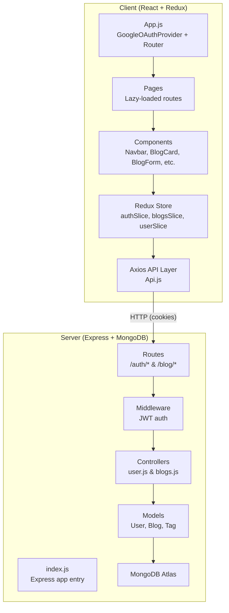
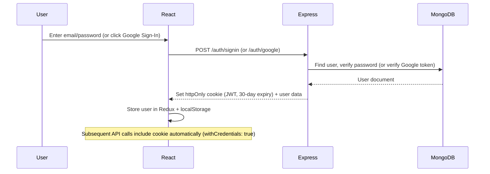

# DevStack — Full Project Walkthrough

**DevStack** is a full-stack blogging platform built with the **MERN stack** (MongoDB, Express, React, Node.js). It supports user authentication (email/password & Google OAuth), blog CRUD, likes, bookmarks, comments, tag-based search, and is deployable via Vercel.

---

## Architecture Overview



---

## File Tree (Key Files)

```
DevStack/
├── client/
│   ├── .env                          # REACT_APP_BASE_URL, REACT_APP_PUBLIC_GOOGLE_API_TOKEN
│   ├── package.json                  # React 18, Redux Toolkit, Tailwind, React Quill, etc.
│   ├── tailwind.config.js
│   ├── public/
│   │   └── DevStack.png              # Logo
│   └── src/
│       ├── index.js                  # ReactDOM root, Redux Provider, CSS imports
│       ├── App.js                    # GoogleOAuthProvider, Router, ToastContainer
│       ├── index.css                 # Tailwind directives + custom styles
│       ├── assets/
│       │   └── google.png            # Google icon for OAuth button
│       ├── helpers/
│       │   ├── removeTags.js         # Strip HTML tags for preview text
│       │   └── useOutsideClick.js    # Hook to detect clicks outside a ref
│       ├── redux/
│       │   ├── Api.js                # Axios instance (baseURL from env, withCredentials)
│       │   ├── store.js              # configureStore with user, auth, blog slices
│       │   ├── checkForTokenExpiry.js
│       │   └── slices/
│       │       ├── authSlice.js      # Login, signup, Google sign-in, logout thunks
│       │       ├── blogsSlice.js     # All blog CRUD, search, bookmark, like, comment thunks
│       │       └── userSlice.js      # Basic user state (mostly unused, auth handles this)
│       ├── components/
│       │   ├── BlogForm.js           # Rich text editor (React Quill) for create/edit blogs
│       │   ├── TagsList.js           # Popular tags sidebar
│       │   ├── LoadingComponent.js   # Spinner
│       │   ├── Blogs/
│       │   │   ├── BlogCard.js       # Blog feed card with like, bookmark, comment actions
│       │   │   ├── BlogDetails.js    # Full blog view with comments section
│       │   │   └── BlogsList.js      # Paginated blog feed list
│       │   ├── Comments/
│       │   │   ├── CommentSection.js  # Comment input form
│       │   │   └── CommentsList.js    # Rendered comments list
│       │   ├── Layout/
│       │   │   ├── WithNavbar.js      # Layout wrapper with Navbar + Outlet
│       │   │   └── WithoutNavbar.js   # Layout wrapper without Navbar
│       │   ├── Navbar/
│       │   │   ├── index.js           # Main navbar with logo, search, create, profile dropdown
│       │   │   ├── SearchBar.js       # Search input with navigation
│       │   │   └── NavbarProfileDroddown.js  # Profile dropdown menu
│       │   ├── Routes/
│       │   │   ├── PrivateRoute.js    # Redirects to /login if not authenticated
│       │   │   └── AnonymousRoute.js  # Redirects to / if already authenticated
│       │   └── UserForm/
│       │       ├── LoginForm.js       # Email/password + Google OAuth login modal
│       │       └── SignUpForm.js      # Registration form modal
│       └── pages/
│           ├── index.js              # Route definitions (lazy-loaded)
│           ├── LandingPage.js        # Home feed + tags sidebar
│           ├── Blog.js               # Single blog detail page
│           ├── AddBlog.js            # Create blog page
│           ├── EditBlog.js           # Edit blog page
│           ├── LoginPage.js          # Standalone login page
│           ├── Bookmarks.js          # Saved blogs page
│           ├── SearchedBlogs.js      # Search/topic results page
│           └── UserPublishedBlogsList.js  # Author's published blogs
│
├── server/
│   ├── .env                          # MONGODB_URI, JWT_SECRET, CLIENT_URL, CLIENT_ID, CLIENT_SECRET
│   ├── package.json                  # Express, Mongoose, JWT, bcrypt, google-auth-library
│   ├── vercel.json                   # Vercel serverless deployment config
│   ├── index.js                      # Express app: CORS, cookie-parser, routes, MongoDB connect
│   ├── middleware/
│   │   └── auth.js                   # JWT verification from httpOnly cookie
│   ├── models/
│   │   ├── User.js                   # name, email, password, blogsSaved, blogsCreated, imgUrl, external_id
│   │   ├── Blog.js                   # title, content, tags, author, likes, comments, createdAt
│   │   └── Tag.js                    # Simple name-only schema (unused in routes)
│   ├── controllers/
│   │   ├── user.js                   # signin, signup, googleSignin, signout, verifyToken, checkUserStatus
│   │   └── blogs.js                  # CRUD, search, topic filter, like/unlike, comment, bookmark
│   └── routes/
│       ├── users.js                  # POST /auth/signin, /auth/signup, /auth/google, GET /auth/signout
│       └── blogs.js                  # GET/POST/PATCH/DELETE /blog/* endpoints
│
├── OAuth.json                        # Google OAuth credentials (should be gitignored)
├── README.md
├── LICENSE (MIT)
└── .gitignore
```

---

## Key Technical Details

### Authentication Flow



- **JWT** stored as an **httpOnly, Secure, SameSite=None cookie** — not accessible via JavaScript
- Google OAuth uses the **authorization code flow** (`flow: 'auth-code'`) via `@react-oauth/google`
- Token expiry: **30 days** for sign-in, **7 days** for sign-up/Google (inconsistency)
- Auth state persisted to `localStorage` under key `"blog-user"` for rehydration on refresh

### State Management (Redux Toolkit)

| Slice | Key State | Purpose |
|-------|-----------|---------|
| `authSlice` | `userData`, `loading`, `error` | Current logged-in user info, auth status |
| `blogsSlice` | `blogsData`, `blogDetails`, `bookmarkedBlogsId`, `searchedBlogs`, `mostPopularTopics`, `blogLikesNumber`, `blogCommentsList` | All blog-related data with pagination |
| `userSlice` | `id`, `firstName`, `lastName`, `email`, `imageUrl` | Basic user profile (largely redundant with authSlice) |

### API Endpoints

| Method | Route | Auth | Description |
|--------|-------|------|-------------|
| `POST` | `/auth/signin` | ✗ | Email/password login |
| `POST` | `/auth/signup` | ✗ | Register new account |
| `POST` | `/auth/google` | ✗ | Google OAuth login |
| `GET` | `/auth/signout` | ✗ | Clear auth cookie |
| `GET` | `/blog` | ✗ | Paginated blog feed (10/page) |
| `GET` | `/blog/:id` | ✗ | Blog details with populated author & comments |
| `POST` | `/blog` | ✓ | Create new blog |
| `PATCH` | `/blog/:id` | ✓ | Update blog (author check) |
| `DELETE` | `/blog/:id` | ✓ | Delete blog |
| `GET` | `/blog/search?search=` | ✗ | Regex search across title, content, tags |
| `GET` | `/blog/topic/:name` | ✗ | Filter blogs by tag |
| `GET` | `/blog/populartags` | ✗ | Top 15 tags by frequency (aggregation pipeline) |
| `GET` | `/blog/likeBlog/:id` | ✓ | Toggle like/unlike |
| `POST` | `/blog/commentBlog/:id` | ✓ | Add comment |
| `POST` | `/blog/bookmarks/:id` | ✓ | Toggle bookmark save/unsave |
| `GET` | `/blog/bookmarks` | ✓ | Get bookmarked blogs |
| `GET` | `/blog/bookmarksId` | ✓ | Get bookmarked blog IDs only |

### Client-Side Routing

| Path | Component | Access |
|------|-----------|--------|
| `/` | `LandingPage` | Public |
| `/blog/:id` | `Blog` → `BlogDetails` | Public |
| `/search` | `SearchedBlogs` | Public |
| `/topic/:name` | `SearchedBlogs` | Public |
| `/login` | `LoginPage` | Anonymous only |
| `/add-blog` | `AddBlog` → `BlogForm` | Private |
| `/edit-blog/:id` | `EditBlog` → `BlogForm` | Private |
| `/bookmarks` | `Bookmarks` | Private |
| `/my-blogs` | `UserPublishedBlogsList` | Private |
| `/author/:id` | `UserPublishedBlogsList` | Private |

---

## Notable Issues & Observations

> [!WARNING]
> ### Bugs Found
> 1. **`signup` controller (line 92-98)** — Missing `res.` before `cookie(...)`. The response chain is broken:
>    ```js
>    res.status(201);
>    cookie("token", token, { ... }).json({ result: newUser }); // ← should be res.cookie(...)
>    ```
> 2. **`updateBlog` thunk** — The actual API call (`axios.patch`) is missing — it just shows a toast without making a request
> 3. **`BookmarkBlog` thunk** — Similarly gutted; the `axios.post` call was removed (comment says "Removed unused response assignment"), so bookmarking does nothing server-side
> 4. **`getRefreshTokens` controller** — References undefined variables `UserRefreshClient`, `clientId`, `clientSecret`, `tokens`
> 5. **OAuth.json committed** — Contains client secret in the repo (though `.gitignore` lists it, it's already tracked)

> [!NOTE]
> ### Design Observations
> - Uses **Tailwind CSS v3** for styling (via `tailwind.config.js`)
> - Rich text editing via **React Quill** with a full toolbar
> - Code splitting via `React.lazy()` + `Suspense` for all page components
> - Pagination pattern: "Show More" button rather than page numbers
> - Optimistic UI updates for likes on `BlogCard`
> - `react-scroll` used for smooth scrolling to comments section in `BlogDetails`
> - The `userSlice` is largely redundant since `authSlice` already manages user data
> - The `Tag` model exists but isn't used in any route — popular tags are derived via MongoDB aggregation on `Blog.tags`

---

## Deployment

- **Server**: Configured for **Vercel** serverless deployment (`vercel.json` routes all requests to `index.js`)
- **Client**: Standard Create React App build (`react-scripts build`)
- CORS is configured to allow only `process.env.CLIENT_URL` with credentials
